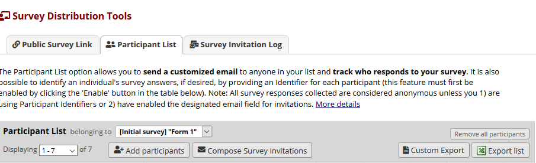

# Custom Participants Export for REDCap

A simple external module for REDCap that enables custom participant export to CSV. 
This module adds a button next to 'Export list' which triggers the download for a custom participant export in .csv format. The customization can be made via module configuration on project level.

## How to
After enabling the module on system level, chose a project where you would like to enable the module. Enable the module and configure its settings:
- Choose a field name that you would like to be added to the CSV export
- *Optionally*: Add a column name for the field name that will be added to the table header. If you do not enter a column name, the field name will be used.

Save the module configuration and go to the Participant List page. Next to the REDCap default button should be an new button. Your custom participant exports can be triggered through that new button.

**Disclaimer**

This module has not been tested with Project that have multiple arms.
Currently on the export of field types "text" is supported. Other field types may output malformatted results.

